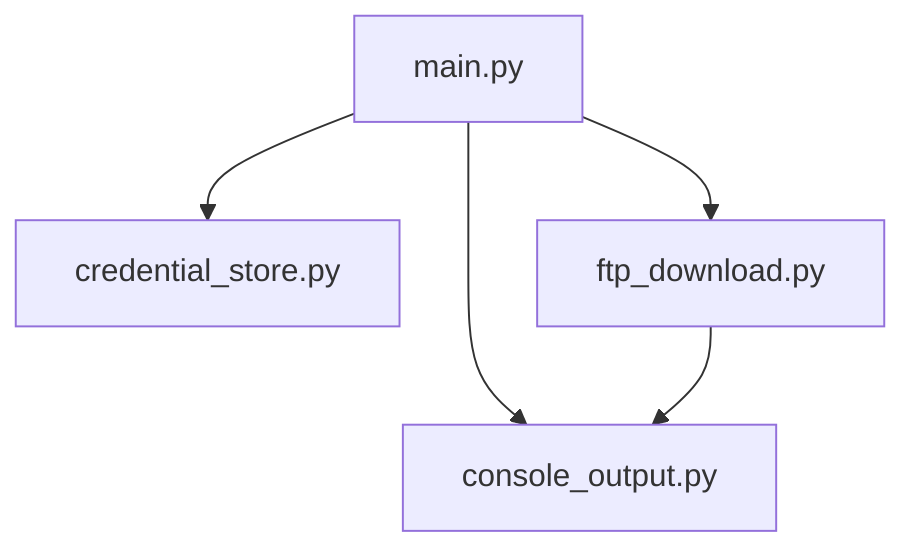

# Architektur

## Überblick

Dieses Projekt besteht bewusst aus wenigen, klar getrennten Python-Modulen.

## Module

### `main.py`

Steuert den gesamten Ablauf:

- Kommandozeilenargumente lesen
- Zielordner vorbereiten
- Zugangsdaten laden oder abfragen
- FTP-Verbindung prüfen
- passende Logdateien herunterladen
- Abschlussausgabe erzeugen

### `functions/credential_store.py`

Verwaltet gespeicherte Zugangsdaten je FTP-Ziel in der Datei `.ftp_credentials.json`.

### `functions/ftp_download.py`

Enthält die Fachlogik für:

- Aufbau der FTP-Verbindung
- Wechsel in den Ordner `/Log`
- Erkennen passender Dateinamen
- Filtern nach Zeitstempel
- Download und Überschreib-Logik

### `functions/console_output.py`

Kapselt die Konsolenausgabe, damit Fortschritt und Statusmeldungen zentral gepflegt werden.

## Datenfluss

1. Das Skript wird mit IP-Adresse, Port, Anzahl Tage und Zielordner gestartet.
2. Gespeicherte Zugangsdaten werden gesucht.
3. Falls keine gültigen Zugangsdaten vorhanden sind, fragt das Skript neue Daten ab.
4. Das Skript verbindet sich mit dem FTP-Server und liest den Ordner `/Log`.
5. Dateinamen mit Zeitstempel werden anhand des gewünschten Zeitraums gefiltert.
6. Passende Dateien werden in den Zielordner geladen und bei Namensgleichheit überschrieben.
