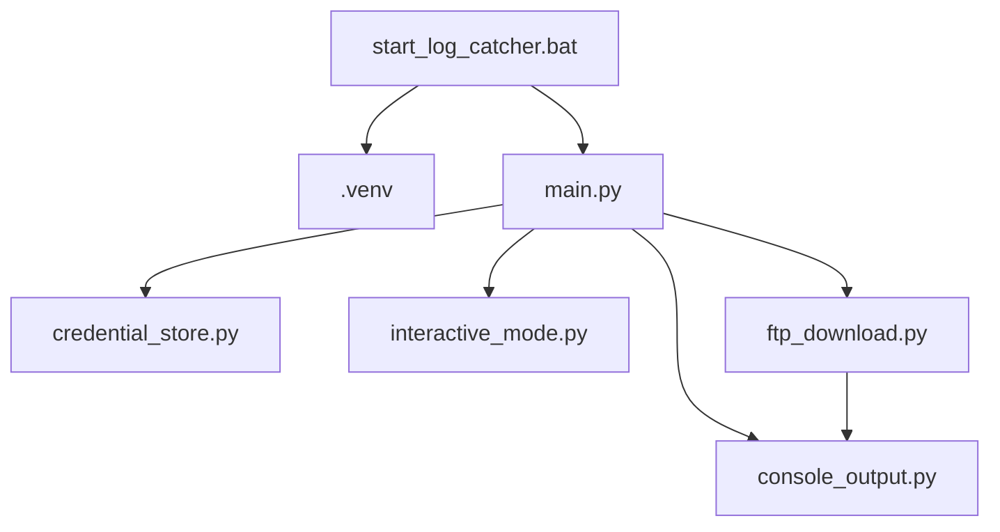

# Architektur

## Überblick

Dieses Projekt besteht bewusst aus wenigen, klar getrennten Python-Modulen.

## Module

### `start_log_catcher.bat`

Prüft unter Windows, ob Python vorhanden ist. Falls nicht, kann die Batch-Datei eine Installation über `winget` anstoßen. Danach wird eine lokale virtuelle Umgebung erstellt und das Python-Skript darin gestartet.

### `main.py`

Steuert den gesamten Ablauf:

- Kommandozeilenargumente lesen
- Zielordner vorbereiten
- Zugangsdaten laden oder abfragen
- FTP-Verbindung prüfen
- passende Logdateien herunterladen
- Abschlussausgabe erzeugen

### `functions/credential_store.py`

Verwaltet gespeicherte Zugangsdaten je FTP-Ziel in der Datei `.ftp_credentials.json`.

### `functions/interactive_mode.py`

Fragt die wichtigsten Eingaben direkt in der Konsole ab, wenn das Skript ohne Parameter gestartet wird. Dadurch ist ein einfacher Windows-Start per Doppelklick möglich.

### `.venv`

Die lokale Python-Umgebung trennt das Projekt von anderen Python-Installationen auf dem Rechner. Das reduziert Probleme mit fehlenden oder falschen Paketversionen.

### `functions/ftp_download.py`

Enthält die Fachlogik für:

- Aufbau der FTP-Verbindung
- Wechsel in den Ordner `/Log`
- Erkennen passender Dateinamen
- Filtern nach Zeitstempel
- Download und Überschreib-Logik

### `functions/console_output.py`

Kapselt die Konsolenausgabe, damit Fortschritt und Statusmeldungen zentral gepflegt werden.

## Datenfluss

1. Das Skript wird mit IP-Adresse, Port, Anzahl Tage und Zielordner gestartet.
2. Gespeicherte Zugangsdaten werden gesucht.
3. Falls keine gültigen Zugangsdaten vorhanden sind, fragt das Skript neue Daten ab.
4. Das Skript verbindet sich mit dem FTP-Server und liest den Ordner `/Log`.
5. Dateinamen mit Zeitstempel werden anhand des gewünschten Zeitraums gefiltert.
6. Passende Dateien werden in den Zielordner geladen und bei Namensgleichheit überschrieben.
