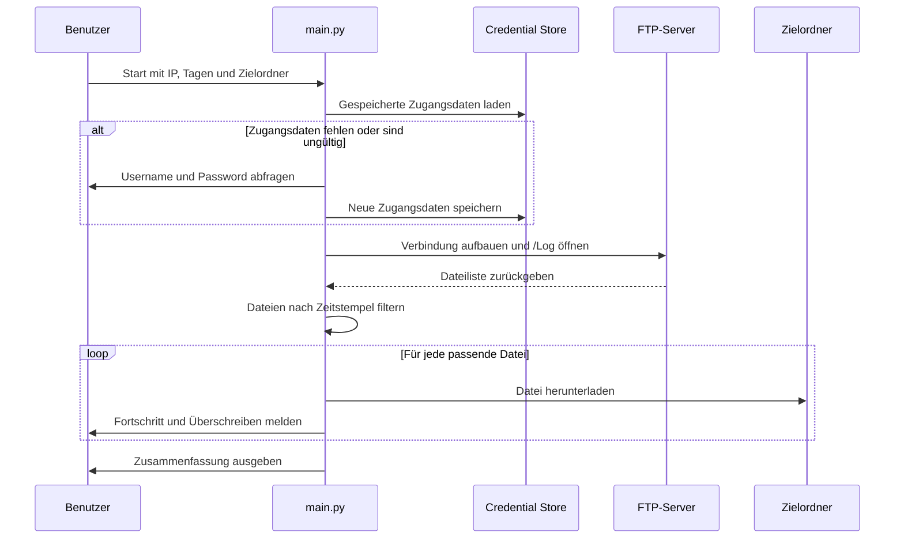

# FTP-Log-Download

## Ablaufbeschreibung

Der Benutzer startet das Skript über die Kommandozeile. Danach prüft das Skript zuerst, ob für das gewünschte FTP-Ziel bereits Zugangsdaten gespeichert wurden. Wenn die Verbindung damit nicht gelingt, werden neue Zugangsdaten abgefragt.

Nach erfolgreicher Verbindung liest das Skript alle Dateien im FTP-Ordner `/Log`, filtert diese über den Zeitstempel im Dateinamen und lädt nur die Dateien im gewünschten Zeitraum herunter.
